# 5. Сравнение производительности приложений на FastAPI. REST и gRPC

## 1. Методология тестирования

Разработаны два сервиса для управления словарём терминов (без использования БД, данные в памяти):
- **REST-сервис** на FastAPI.
- **gRPC-сервис** с использованием Protocol Buffers.

В каждом реализованы три операции: `GET`, `POST`, `PUT`.

### Нагрузочное тестирование
Проведено с помощью **Locust**.

**Поведение виртуальных пользователей:** Последовательное выполнение операций с паузой 1-3 секунды. Распределение запросов: 60% `GET`, 30% `POST`, 10% `PUT`.

**Сценарии нагрузки:**

| Сценарий | Макс. пользователей | Пользователи в сек | Длительность, сек |
|--------------------------------|------|---|-----|
| Лёгкая нагрузка (Sanity Check) | 10   | 2 | 30  |
| Рабочая нагрузка               | 100  | 5 | 60  |
| Стресс-тест (пиковая)          | 1000 | 5 | 120 |
| Тест на стабильность           | 30   | 5 | 300 |           

## 2. Инструкция по запуску

### Общие шаги
```bash
# Создание виртуального окружения
python -m venv venv

# Активация (Windows)
venv\Scripts\activate

# Установка зависимостей
pip install -r requirements.txt
```

### Запуск REST-сервиса
```bash
# Запуск сервера
uvicorn rest.app:app

# В отдельном терминале - запуск тестов
python -m locust -f locust-tests/rest_client.py --host=http://127.0.0.1:8000
```

### Запуск gRPC-сервиса
```bash
# Генерация кода из .proto файла
python -m grpc_tools.protoc -Igrpc/protobufs --python_out=grpc --grpc_python_out=grpc grpc/protobufs/glossary.proto

# Запуск сервера
python grpc/server.py

# В отдельном терминале - запуск тестов
python -m locust -f locust-tests/grpc_client.py --host=http://127.0.0.1:50051
```

**Веб-интерфейс Locust** доступен по адресу: `http://localhost:8089`

## 3. Тестовая среда

| Параметр | Значение |
|----------|----------|
| Модель устройства | Acer Aspire 15 A15-41M-R309 |
| Процессор | AMD Ryzen 5 7535U (6 ядер/12 потоков) |
| Тактовая частота | 2.9 ГГц |
| Видеокарта | AMD Radeon 660M |
| Оперативная память | 16GB DDR5, 3200 МГц |
| Операционная система | Windows 10 Pro 22H2 |
| Браузер тестирования | Google Chrome 143.0.7499.170 |

## 4. Результаты тестирования

### REST-сервис
| Тест | Метрики | Графики |
|------|---------|---------|
| 1. Лёгкая нагрузка | 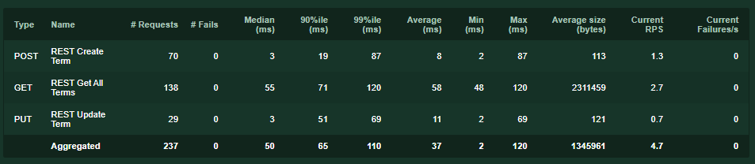 |  |
| 2. Рабочая нагрузка | 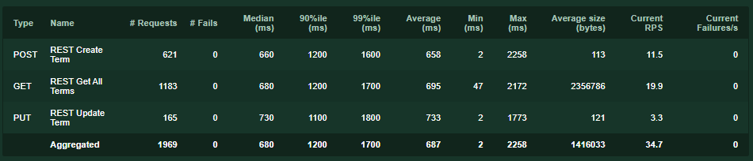 | 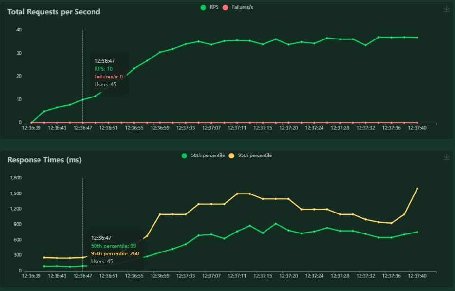 |
| 3. Стресс-тест | 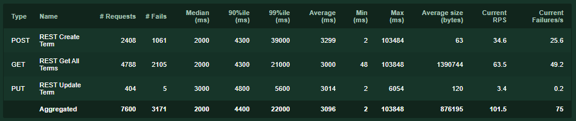 | 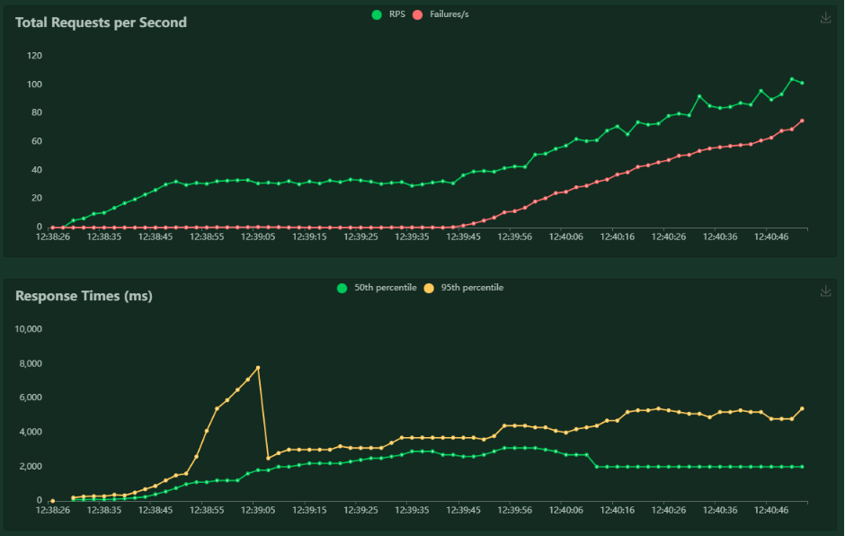 |
| 4. Стабильность | 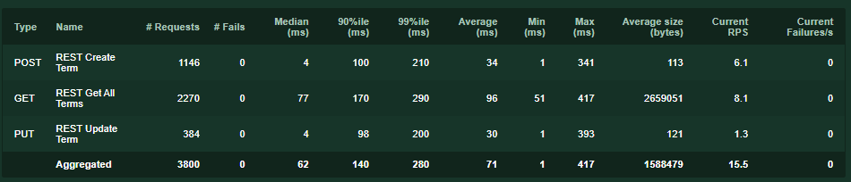 | 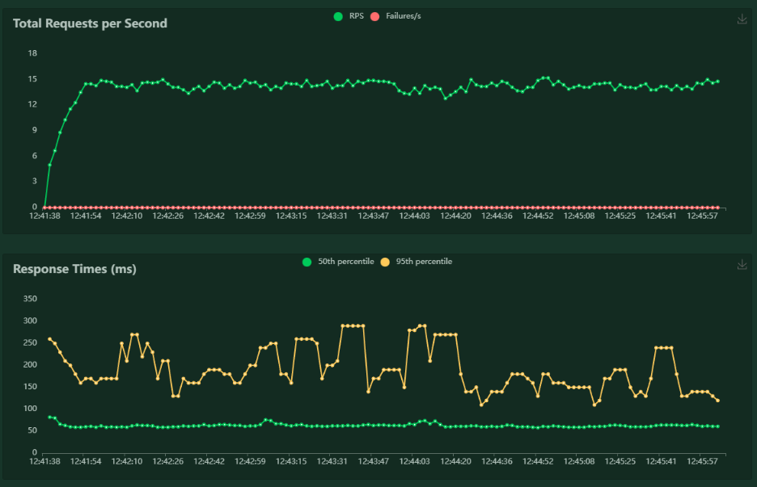 |

### gRPC-сервис
| Тест | Метрики | Графики |
|------|---------|---------|
| 1. Лёгкая нагрузка | 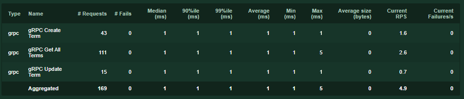 | 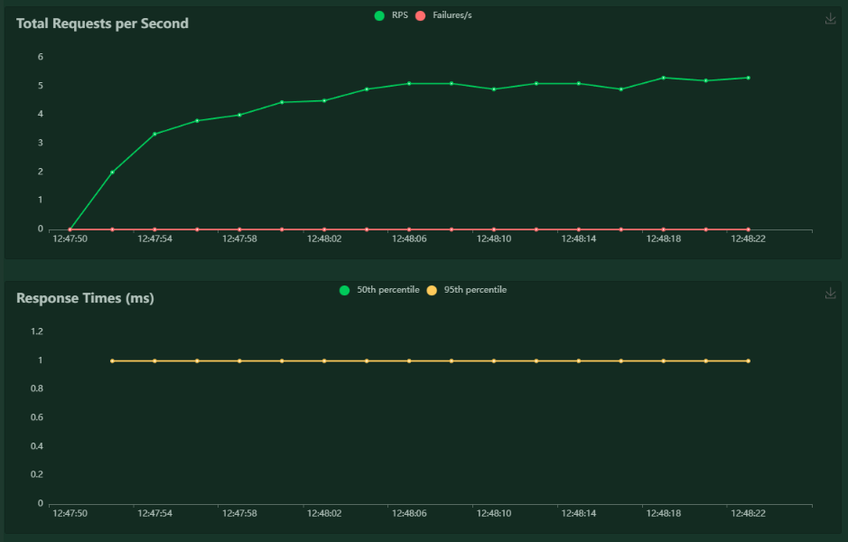 |
| 2. Рабочая нагрузка | 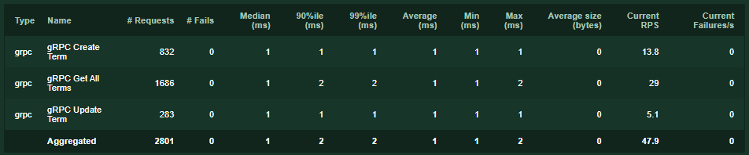 | 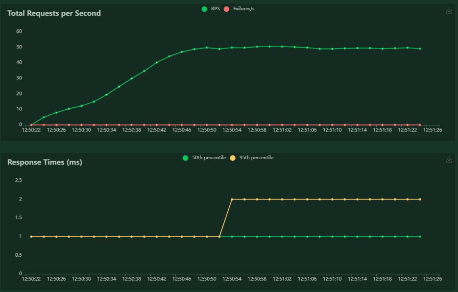 |
| 3. Стресс-тест | 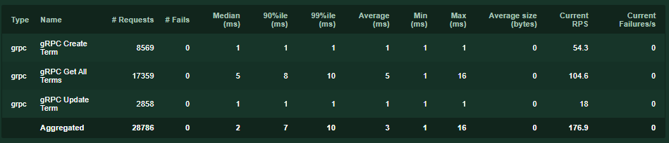 | 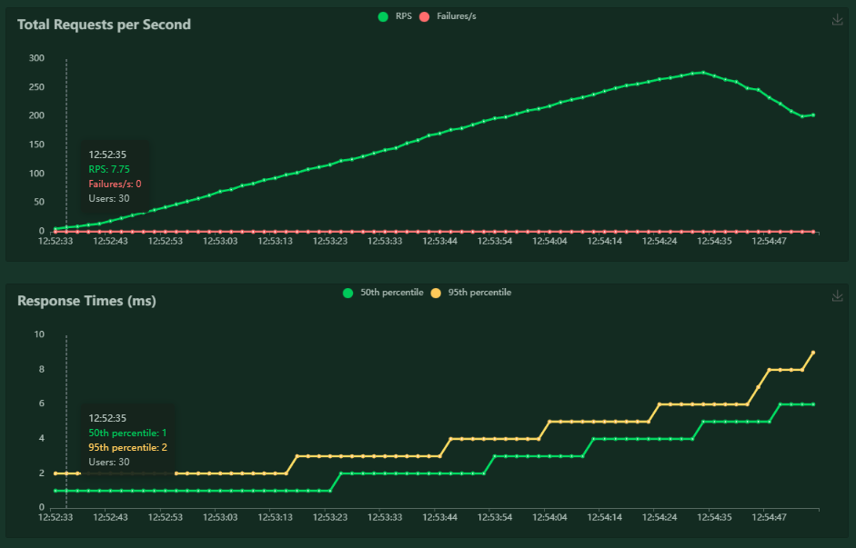 |
| 4. Стабильность | 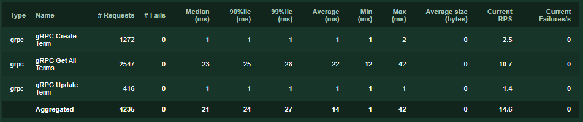 | 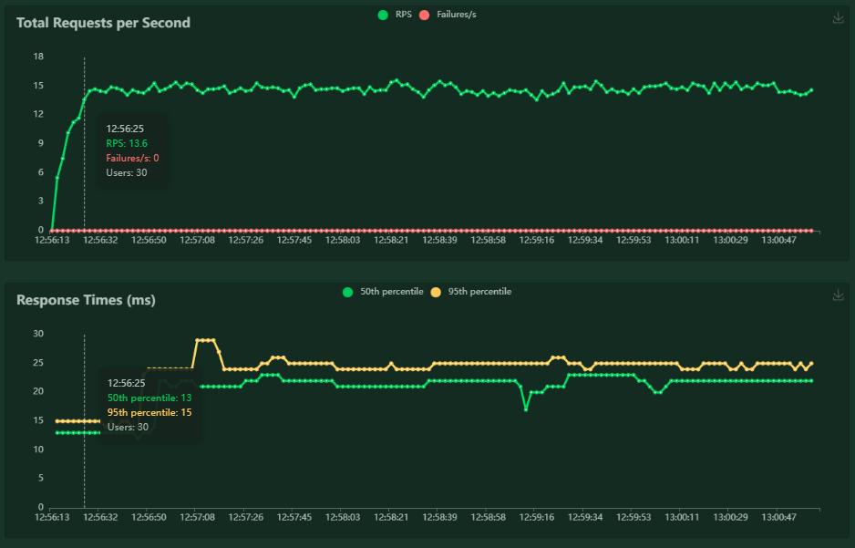 |

## 5. Ключевые выводы

### 5.1. Устойчивость к нагрузке
Сервис, основанный на gRPC, показал значительно большую устойчивость:
- У REST-сервиса наблюдалась деградация производительности при примерно 500 одновременных пользователях.
- gRPC не столкнулся с серьезными проблемами при такой нагрузке.

### 5.2. Производительность
- gRPC продемонстрировал более высокие и стабильные показатели RPS (запросов в секунду).
- У gRPC лучшая латентность, особенно на высоких перцентилях при пиковой нагрузке.
- При низкой и умеренной нагрузке значения RPS были сопоставимы.

### 5.3. Архитектурные наблюдения
- Отсутствие механизма удаления данных и хранение всего набора в памяти могут привести к утечкам памяти при длительной эксплуатации.
- Рекомендация: внедрить пагинацию для GET-запросов.

## 6. Сравнение REST и gRPC

| Критерий | REST (FastAPI) | gRPC |
|----------|---------------|------|
| Простота реализации | Высокая | Средняя/Низкая |
| Скорость отладки | Высокая | Средняя |
| Производительность | Умеренная | Высокая |
| Потребление памяти | Выше | Ниже |
| Устойчивость к нагрузке | До ~500 пользователей | Выше 500 пользователей |
| Overhead передачи | JSON (больше) | Protobuf (меньше) |

### Рекомендации по применению:

Выбирайте REST (FastAPI) в следующих случаях:
- Не требуется обрабатывать экстремальные нагрузки.
- Важна скорость разработки и отладки.
- Нужна простота интеграции с фронтенд-частью.

Выбирайте gRPC в таких ситуациях:
- Используется микросервисная архитектура.
- Необходима внутренняя коммуникация между сервисами.
- Существуют высокие требования к производительности.
- Требуется эффективная работа при высокой нагрузке.

## 7. Ограничения и рекомендации

### Ограничения эксперимента:
1. Все компоненты функционировали на одной машине.
2. Нагрузка была искусственной.
3. Не использовалась настоящая база данных и внешние зависимости.
4. Тестирование проводилось исключительно в локальной среде.

### Возможные улучшения:
1. Интеграция с базой данных: Добавить PostgreSQL/Redis для более реалистичного тестирования.
2. Распределенное тестирование: Проведение тестов в облачной среде с учетом сетевых факторов.
3. Разнообразие аппаратного обеспечения: Тестирование на различных конфигурациях.
4. Расширение сценариев: Включить операции DELETE и сложные запросы.
5. Мониторинг ресурсов: Подробное отслеживание использования CPU, памяти и сети.

## 8. Заключение

1. Главный вывод: gRPC продемонстрировал большую стабильность и производительность при высокой нагрузке, однако его реализация и настройка являются более сложными.

2. Оптимизация: Для эффективного промышленного использования обоих сервисов следует:
   – Реализовать пагинацию
   – Внедрить механизм удаления устаревших данных
   – Изучить возможности кэширования

3. Баланс: Выбор между REST и gRPC должен основываться на специфических требованиях проекта, таких как время разработки, предполагаемая нагрузка и уровень сложности интеграции.


### Задание

Сравнить с помощью Locust приложения с глоссарием на предмет производительности их работы

Освоить методы проведения нагрузочного тестирования сетевых сервисов (REST и gRPC), научиться использовать инструмент Locust для генерации нагрузки, анализа поведения приложения под разными профилями нагрузки и формализации результатов.

1. **Развернуть приложения, разработанные в рамках предыдущих заданий (словарь терминов):**
FastAPI с использованием REST-подхода. 
приложение-словарь с использованием подхода RPC и передачи данных по протоколу protobuf. 

2. **Приложение должно содержать минимум 2 разных эндпоинта/метода, отличающихся логикой или трудоёмкостью.**
**Настроить нагрузочное тестирование с помощью Locust:**
Написать один или два класса пользователей (User/GrpcUser) в зависимости от тестируемых протоколов.
Смоделировать реалистичное поведение клиентов: разные сценарии запросов, пропорции между ними, паузы, последовательности действий.
Настроить параметры запуска Locust: количества пользователей, скорость подъёма нагрузки, длительность теста.

3. **Провести тестирование по нескольким сценариям нагрузки:**
- Лёгкая нагрузка (sanity check): убедиться, что всё работает.
- Рабочая нагрузка (нормальный режим): подобрать параметры, имитирующие реалистичное использование.
- Стресс-тест (приближение к пику): выявить пределы производительности.
- Тест на стабильность (при длительной нагрузке): проверить деградацию.
- Зафиксировать метрики:

- RPS (запросов в секунду),
- среднее время ответа,
- распределение латентности (p95/p99),
- количество ошибок,
- момент наступления деградации,
- влияние увеличения числа пользователей.
- Сравнить результаты REST и gRPC:

- обнаружить различия в пропускной способности и задержках,
- оценить влияние размера сообщений, сериализации, network-overhead.
- Требования к отчёту
- Отчет разместить в репозитории, отразите отчет с помощью файла с разметкой Markdown, где демонстрировался бы процесс развертывания и работы сервиса.

Опишите тестируемое приложения (архитектура, используемые технологии, использовалась ли БД, какие данные возвращаются, какие данные необходимы для выполнения запроса на добавление).

1. **Укажите настройки тестовой среды**
- аппаратные ресурсы (CPU, RAM, сеть),
- архитектуру стенда (что где запущено),
- версию Locust,
- дополнительные инструменты мониторинга (если использовались).

2. **Тестовые сценарии**
**Для каждого сценария описать:**
- логика поведения пользователя (task flow),
- конфигурация нагрузки (пользователи, spawn rate, длительность),
- ожидания перед запуском (гипотезы).
- Приложить фрагменты тестового кода Locust.

3. **Результаты тестирования**

**Для каждого сценария включить:**

3.1. **Основные метрики:** 
- RPS / Throughput,
- среднее время ответа,
- p95/p99 latency,
- количество ошибок (5xx/timeout/connection errors),
- графики или таблицы (можно экспорт Locust или собственные визуализации).

3.2. **Анализ результатов:** 
- На каком количестве пользователей начинается деградация?
- Как изменяется латентность при росте нагрузки?
- Где «бутылочное горлышко» — CPU, база данных, сеть, сама реализация сервиса?
- Отличаются ли результаты REST и gRPC?

4. **Сравнить REST и gRPC**
- численное сравнение латентности,
- сравнение RPS,
- анализ overhead,
- выводы о применимости каждого подхода.

**В заключении обязательно включить:**
- основные выводы,
- рекомендации по оптимизации,
- возможные улучшения эксперимента,
- ограничения проведённого тестирования.

**Исследовательская задача**
- Составьте подборку статей, где проводилось бы сравнение реализаций микросервисной архитектуры с помощью подходов REST и RPC, 
- GraphQL. 

Приоритет — исследования, где выполнялись бы замеры и бенчмарки. Приведите наиболее важные результаты таких исследований. Составьте краткое резюме этих исследований.
